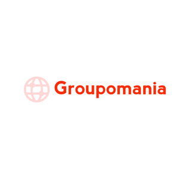

# *Groupomania* reseau social entreprise
========================================================================================================================================
## projet 7 parcours de developpeur web openClassRoom.
------------------------------------------------------------------------------------------------------------------------------------------

### Projet que j'ai choisi de developper avec le full stack M.E.R.N!

**Mongoose**,**React**, **Express** et **node** que j'ai decouvert lors de ce premier projet fullstack !

#### Pour demarrer le projet, cloner le et faite un npm install dans le dossier back, et le front pour ajouter les modules de node

il faut créer un compte sur mongoDB, creer un cluster,et de placer vos identifiant et mot de passe dans app.js dans le module mongoose !

* et ajouter un fichier .env avec vos données :
    * BD_USERNAME : identifiant mongoose 
    * BD_PASS: mot de pass mongoose
    * PORT: port de l api
    * KEY_TOKEN: phrase secrete 

### Pour le backend Se placer dans le dossier back avec un terminal et taper npm start, il devrait ecouter le localhost:3000

### Pour le front se placer dans le dossier front avec un terminal et taper npm start, il devrait écouter le localhost:4200

